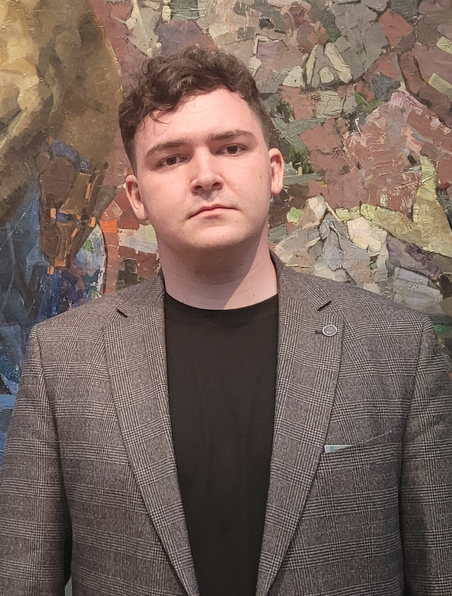

<!-- README.md — минималистичный шаблон профиля -->

# 👋 Привет!

## 🙋‍♂️ О бо мне  
Я дата-сайентист, специализирующийся на медицинских задачах — компьютерное зрение, NLP клинических текстов и анализ биомедицинских данных.  
Люблю открытый код, reproducible research и кофе-driven хакатоны. Всегда открыт к сотрудничеству и интересным проектам.

 

---

## 🚀 Стек технологий  

- **Python** (pandas, NumPy, SciPy)&nbsp;  
- PyTorch · TensorFlow · scikit-learn  
- OpenCV · MONAI (медицинские изображения)  
- FastAPI · Streamlit  
- Docker · Git · DVC · MLflow  
- PostgreSQL  
- AWS · GCP  

---

## 🌟 Флагманские репозитории

| Репозиторий | Одним предложением |
|-------------|--------------------|
| [`med-cv-diagnosis`](https://github.com/your-username/med-cv-diagnosis) | Классификация рентген/КТ-снимков |
| [`retinal-segmentation`](https://github.com/your-username/retinal-segmentation) | Сегментация сосудов глазного дна |
| [`fhir-data-pipeline`](https://github.com/your-username/fhir-data-pipeline) | ETL-конвейер FHIR → Parquet |
| [`clinical-notes-nlp`](https://github.com/your-username/clinical-notes-nlp) | Извлечение диагнозов из историй болезни (BERT) |

> ℹ️ Замените `your-username` на свой ник; ссылки и описания — заглушки.

---
