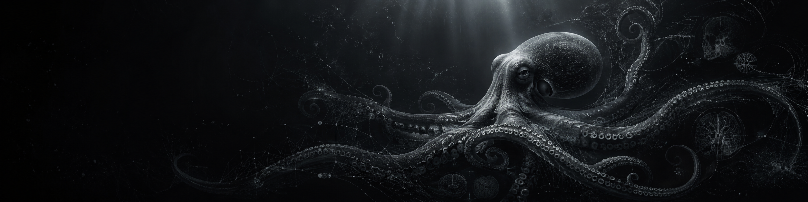
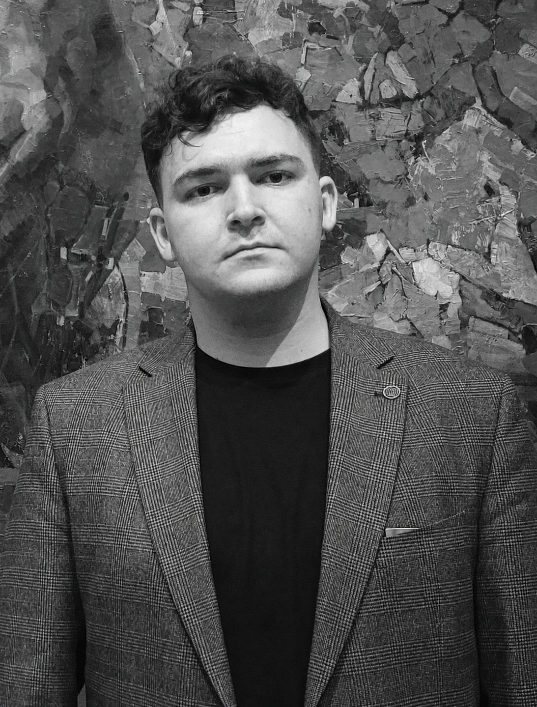

# Роман Юровских

### Младший научный сотрудник · Ведущий ML-инженер · Исполняющий обязанности заведующего лабораторией математического моделирования

**Медицинский искусственный интеллект · Компьютерное зрение · Анализ медицинских изображений · Научное программное обеспечение**

  
  
  
  
  

*От медицинских изображений и видеопотоков к воспроизводимым данным,* 
*измеримым результатам и прикладным исследовательским системам.*

**你好 · Привет · Hi**

---

## Обо мне

Я инженер машинного обучения и исследователь. Работаю на пересечении
искусственного интеллекта, медицины, математического моделирования и разработки
научного программного обеспечения.

Моя профессиональная деятельность связана с Лабораторией математического
моделирования Башкирского государственного медицинского университета. В работе
я объединяю исследовательские задачи, программную инженерию и техническое
руководство. Особое внимание уделяю медицинскому компьютерному зрению,
воспроизводимым экспериментам, количественному анализу и понятной визуализации
результатов.

Для меня важно не только разработать модель, но и построить целостную систему:
определить границы задачи, подготовить данные, организовать проверяемый
эксперимент, исследовать ошибки, создать удобный инструмент и представить
результат в форме, понятной специалисту предметной области.

 

---

## Профессиональный профиль

| Направление | Опыт и интересы |
|---|---|
| **Основная область** | Искусственный интеллект в медицине |
| **Специализация** | Компьютерное зрение, медицинские изображения, видеоаналитика |
| **Исследовательские задачи** | Детекция, сегментация, ключевые точки, трекинг, количественная морфология |
| **Инженерный фокус** | Воспроизводимые ML-пайплайны, версии наборов данных, тестирование моделей |
| **Научное ПО** | Настольные приложения, CLI-инструменты, визуализация, структурированные отчёты |
| **Основной стек** | Python, PyTorch, MONAI, OpenCV, VTK, DICOM |
| **Дополнительная область** | Математическое моделирование и научные вычисления |
| **Местоположение** | Уфа, Россия |

---

## Основные направления работы

### Медицинское компьютерное зрение

Разработка методов анализа медицинских изображений и видео: поиск объектов,
сегментация анатомических структур, оценка ключевых точек, отслеживание объектов
во времени, анализ качества изображений и получение количественных показателей.

### Анализ хирургического видео

Исследование видеоданных робот-ассистированных и малоинвазивных операций.
Направление включает распознавание хирургических инструментов, анализ их
положения и движения, временную обработку видеопоследовательностей и подготовку
структурированных исследовательских наборов данных.

### Анализ КТ, КЛКТ и ультразвуковых изображений

Работа с двумерными и объёмными медицинскими данными, выделение областей
интереса, сегментация тканей, построение трёхмерных представлений и расчёт
геометрических характеристик. Отдельный интерес представляют стоматологические
исследования, ультразвуковая диагностика и анализ сосудистых структур.

### Научное программное обеспечение

Создание исследовательских программ как поддерживаемых систем, а не отдельных
экспериментальных блокнотов. Это включает модульную архитектуру, конфигурации,
интерфейсы, журналы обработки, проверку входных данных, визуализацию и экспорт
результатов.

### Математическое моделирование

Численное исследование физических и биомедицинских процессов, проведение
вычислительных экспериментов, обработка результатов и создание интерактивной
научной визуализации.

---

# Проекты и исследовательские направления

Ниже представлены основные названия проектов и их предметные области. Часть
разработок находится на исследовательской стадии, поэтому описание намеренно
ограничено общим направлением без публикации внутренних технических деталей.

## OpeLab / ML-Learn-DaVinci

Исследовательское направление в области компьютерного зрения для
робот-ассистированной хирургии. Проект связан с анализом хирургического видео,
распознаванием инструментов, исследованием движений и подготовкой данных для
обучения и проверки моделей.

`Хирургическое видео` · `Детекция` · `Ключевые точки` · `Трекинг` · `Видеоаналитика`

## OpeTrace

Программные и информационные решения для организации медицинских видеоданных.
Основное направление связано со структурированием исследований, хранением
метаданных, учётом разметки и формированием воспроизводимого исследовательского
процесса.

`Медицинские данные` · `Метаданные` · `Версионирование` · `Исследовательское ПО`

## MorphiDentAI

**Другие названия проекта: Deep2Dent, ДентАналитика**

Единый проект в области анализа стоматологических КТ и КЛКТ, для которого на
разных этапах использовались названия MorphiDentAI, Deep2Dent и ДентАналитика.
Направление объединяет обработку объёмных изображений, сегментацию структур
зуба, трёхмерную визуализацию и исследование количественных морфологических
характеристик.

`Стоматология` · `КЛКТ` · `Сегментация` · `3D-реконструкция` · `Морфология`

## ArtPiece / CoronaryCurvature

Исследовательское программное обеспечение для анализа геометрии коронарных
артерий. Проект посвящён работе с сосудистыми структурами, их центральными
линиями, формой и количественными геометрическими характеристиками. Моя роль
связана с взаимодействием с клиникой, формированием технического задания,
работой с результатами проекта и их интеграцией в клинический процесс.

`Взаимодействие с клиникой` · `Техническое задание` · `Работа с результатами` · `Интеграция`

## RenVisio / KidneyTumorSearch

**Статус: проект заморожен**

Направление компьютерного зрения для анализа ультразвуковых изображений почек.
Работа связана с поиском областей интереса, исследованием новообразований,
классификацией изображений и визуальным представлением результатов модели.

`Ультразвук` · `Локализация` · `Классификация` · `Медицинское компьютерное зрение`

<strong>Другие проекты и исследовательские темы</strong>

 

### Model Benchmark

Общее направление по независимому сравнению моделей компьютерного зрения,
анализу качества и формированию воспроизводимых отчётов.

### Оценка опорных зубов

Исследовательская задача по анализу стоматологических данных и геометрических
показателей, связанных с планированием ортопедических конструкций.

### Медицинский геномный пайплайн

Воспроизводимая обработка данных секвенирования, проверка входных файлов,
контроль качества и организация последовательных вычислительных этапов.

### Медицинский RAG-ассистент

Исследование систем поиска и формирования ответов на основе контролируемой
медицинской и научной документации.

### SimplySintering

Математическое моделирование и визуализация процессов спекания керамических
материалов.

### Cold Spray Multiparticle

Численное моделирование многочастичных процессов холодного газодинамического
напыления.

### Дополнительные прототипы

- анализ изображений отпечатков стоп;
- концепция приложения для релаксации в виртуальной реальности;
- образовательные проекты по программированию, анализу данных и медицинскому ИИ.

---

# Компетенции

## Компьютерное зрение

`Детекция объектов` · `Семантическая сегментация` · `Экземплярная сегментация` ·
`Оценка позы` · `Ключевые точки` · `Мультиобъектный трекинг` ·
`Временной анализ` · `Контроль качества изображений`

## Медицинские изображения

`DICOM` · `КТ` · `КЛКТ` · `Ультразвук` · `Хирургическое видео` ·
`Объёмная обработка` · `3D-реконструкция` · `Генерация сеток` ·
`Мультипланарная визуализация` · `Геометрические измерения`

## Машинное обучение

`PyTorch` · `MONAI` · `YOLO` · `U-Net` · `UNETR` · `nnU-Net` ·
`scikit-learn` · `TensorFlow` · `Keras` · `XGBoost` · `ONNX` · `TensorRT`

## Анализ данных и визуализация

`NumPy` · `SciPy` · `Pandas` · `OpenCV` · `VTK` · `SimpleITK` ·
`Matplotlib` · `Plotly` · `Статистический анализ` · `Научная визуализация`

## Разработка программного обеспечения

`Python 3.11+` · `Bash` · `SQL` ·
`Qt` · `PySide` · `PyQt` · `FastAPI` · `REST API` ·
`CLI-приложения` · `Настольные приложения`

## Данные и инфраструктура

`PostgreSQL` · `MySQL` · `MongoDB` · `Redis` · `MinIO` · `S3` ·
`Git` · `GitHub Actions` · `Docker` · `Linux` · `CUDA` · `NVIDIA`

## Воспроизводимость исследований

`MLflow` · `DVC` · `Версии наборов данных` · `Реестры моделей` ·
`Конфигурации экспериментов` · `Контрольные суммы` · `Журналы обработки` ·
`Автоматическая проверка` · `Структурированные отчёты`

<strong>Принципы инженерной и исследовательской работы</strong>

 

- формулировать исследовательский вопрос до выбора модели;
- заранее определять границы системы и критерии оценки;
- разделять данные по независимым клиническим случаям;
- сохранять отдельный набор данных для итоговой проверки;
- контролировать версии данных, разметки, конфигураций и моделей;
- изменять по одному фактору в контролируемых экспериментах;
- анализировать ошибки по классам, объектам и временным фрагментам;
- отделять качество модели от качества всей программной системы;
- сохранять результаты в машиночитаемой и понятной специалисту форме;
- различать исследовательские гипотезы и клинические утверждения.

---

## Научное и техническое руководство

В качестве исполняющего обязанности заведующего лабораторией математического
моделирования я участвую в планировании исследовательских направлений,
технической постановке задач, координации проектов и организации взаимодействия
между разработчиками, исследователями и медицинскими специалистами.

Основные виды деятельности:

- формирование технических требований и критериев приёмки;
- планирование этапов научных и программных проектов;
- проектирование архитектуры исследовательских систем;
- организация работы с данными и вычислительными ресурсами;
- анализ планов разработки моделей и результатов экспериментов;
- стандартизация документации и воспроизводимости;
- сопровождение студенческих и исследовательских проектов;
- подготовка технических, научных и регистрационных материалов.

---

## Образование

### Магистратура

**Уфимский университет науки и технологий** 
02.04.01 - Анализ данных и компьютерное моделирование 
2025-2027, обучение продолжается

 

### Бакалавриат

**Уфимский университет науки и технологий** 
02.03.01 - Математика и компьютерные науки 
2021-2025

 

Академическая подготовка объединяет математику, алгоритмы, численные методы,
теорию вероятностей, статистику, анализ данных, компьютерное моделирование и
научные вычисления.

---

# Сотрудничество

Мне интересны научные и инженерные задачи, в которых требуется объединить
медицинскую экспертизу, анализ данных, машинное обучение, математические методы
и разработку программного обеспечения.

Основные направления сотрудничества:

- анализ робот-ассистированных операций и хирургического видео;
- детекция, сегментация, ключевые точки и трекинг;
- стоматологические КТ и медицинская 3D-реконструкция;
- количественная морфология сосудов;
- компьютерное зрение для ультразвуковых изображений;
- организация медицинских наборов данных;
- воспроизводимые тесты и сравнение моделей;
- научные настольные приложения и экспертная визуализация;
- математическое моделирование в медицине и материаловедении;
- совместные исследования, публикации и образовательные проекты.

### Чем я могу быть полезен

`Формализация задачи` · `Техническое задание` · `Протокол работы с данными` ·
`Базовая ML-модель` · `Детекция` · `Сегментация` · `Трекинг` ·
`Сравнение моделей` · `Анализ ошибок` · `Научный интерфейс` ·
`3D-визуализация` · `Количественные метрики` · `Техническая документация`

### Контакты

[GitHub](https://github.com/RSYur) ·
[Электронная почта](mailto:rsyurovskih@bashgmu.ru) ·
[Сайт лаборатории](https://labmatmod.ru/about/)

**Создаю проверяемые системы медицинского искусственного интеллекта: от данных до исследовательского программного решения.**

Роман Юровских · Уфа · 2026

---

> [!NOTE]
> Репозитории и описания профиля могут содержать исследовательские прототипы,
> экспериментальные результаты, ранние версии программ и неклиническую
> валидацию. Если явно не указано иное, эти системы не являются
> сертифицированными медицинскими изделиями и не предназначены для автономной
> постановки диагноза.
